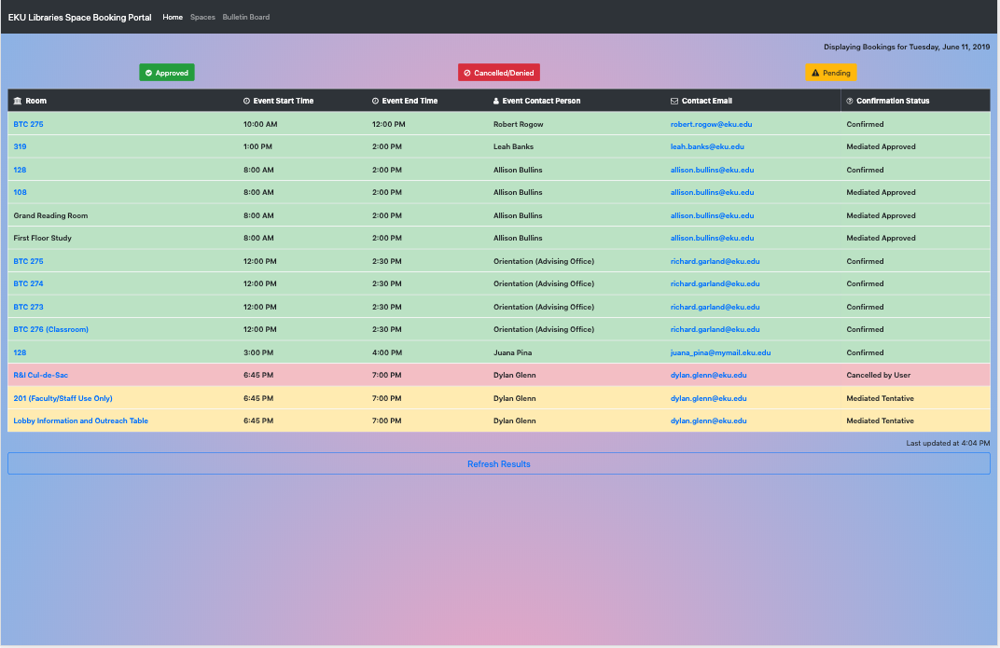

# libcal-bookings-viewer
A custom view for our LibCal bookings page that utilizes the Springshare LibCal API, HTML, and JS.

## Project Origin and Specs

The current site utilizes iFrames and a pre-rendered widget feature from a previous version of Springshare. The request was to make a new dashboard that would combine the info in the various widgets into a central, easy-to-view dash. I decided to utilize the LibCal API for customization and so that we could use responsive, customized design instead of widgets.

## Config

## Credentials

The LibCal API docs recommend exposing the secret in cases of read-only apps. I dislike this for obvious reasons. I am working to get approval to integrate this project with Azure authentication and utilize oauth more securely. For the time being though, this is what the docs suggest and what has been requested in the project spec...

## Additional Resources

### Before:

### After:

### Continued because iFrames...

